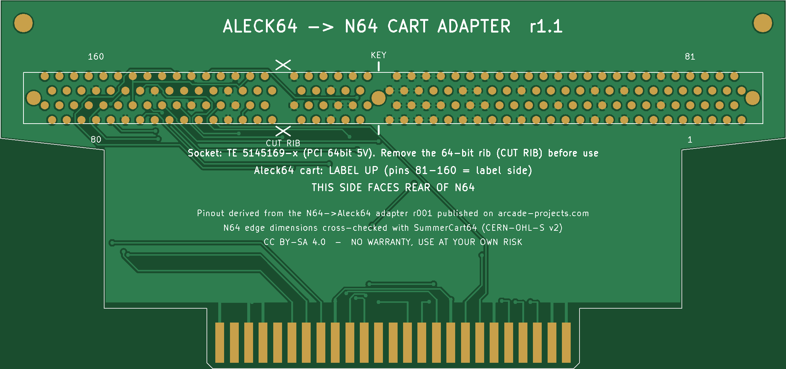

# Aleck64 → N64 カートリッジ変換アダプタ r1.1

Aleck64（SETA のアーケード基板）のカートリッジを、Nintendo 64 本体に挿して使うための変換基板。
動作確認済み（r1 で実機動作確認）。

## PCBWay 発注設定
| 項目 | 設定 |
|---|---|
| アップロード | `Aleck64_to_N64_r1.1_gerber.zip` |
| 層数 | 2 |
| 基板サイズ | 約 136 × 64 mm |
| **板厚** | **1.2 mm**（N64スロット用。1.6mm では入りません） |
| **Gold fingers** | **Yes**（N64側エッジ）＋ **Beveling / 面取り 45°** |
| 表面処理 | ENIG 推奨（HASL でも可） |
| 最小配線/間隔 | 0.2 / 0.2 mm、最小穴 0.3 mm |

## 部品
- J2: **TE Connectivity 5145169-4**（PCI 64bit / 5V キー / 184ピン）。5145169-8、1-5145169-2 も同じフットプリント。

## 組み立て
1. **コネクタの 64bit 部の仕切り（リブ）を切り取る**。シルクの「CUT RIB（×印）」の位置。5V キー（シルク「KEY」）は残す。
2. コネクタをシルク面（表）から挿してハンダ付け。穴配置が非対称なので逆には入りません。
3. Aleck64 カートは **ラベル面（81〜160ピン側）を上** にして挿す。キーが合う向きにしか入りません。

## 使い方
- コネクタのある面を **N64 本体の後ろ側** に向けて挿す（裏面シルク「N64 FRONT SIDE」が本体手前）。
- カートは本体後方へ水平に張り出す。重いので支えると安心。

## 注意
- コネクタ全長 128mm は純正 BURNDY（約110mm）より長く、カートのシェル下端と干渉する場合がある。
- PCI コネクタは 1.57mm 厚基板向けのため、1.2mm だとツメが効きにくい（ハンダ付けで固定される）。
- Aleck64 の 54/55/134/135 ピン（すべて NC）は、切り取ったリブの位置にあたるため未接続。
- ゲームによっては N64 で正常に動作しない可能性がある。

## 検証
- KiCad DRC：エラー0 / 未配線0
- 出力 Gerber を画像化して導通を独立に再チェック：29ネットすべて期待通り
- ドリル座標を TE 図面と照合：固定穴間隔 64.77 / 59.69 mm、4列（±1.27 / ±3.81 mm）、184穴

## 由来とクレジット
- ピン対応（ネットリスト）は、arcade-projects.com で公開されている **N64 → Aleck64 変換アダプタ r001** の Gerber から導通を読み取り、同スレッドで公開されているピン配置表（Seta 3D Rom PCB-2A）と照合したもの。元データの作者・公開者に感謝します。
  - スレッド: https://www.arcade-projects.com/threads/n64-cartridge-adapter-for-seta-aleck-64.20932/
  - r001 の配線に加えて Aleck64 74→N64 8 (/WR)、77→44、156→45 (NMI) も同様に接続。
- N64 カードエッジの寸法は **SummerCart64**（Mateusz Faderewski、ハードウェアは CERN-OHL-S v2）の公開データと照合して確認。ファイルの流用はしていない。
  - https://github.com/Polprzewodnikowy/SummerCart64
- N64 コネクタのピン配列は ConsoleMods Wiki を参照。 https://consolemods.org/wiki/N64:Connector_Pinouts
- ソケットのフットプリントは TE Connectivity の図面 ENG_CD_5145169 の寸法に基づく（図面そのものは同梱していない）。

## ライセンス
本リポジトリ（基板データ、スクリプト、ドキュメント）は **CC BY-SA 4.0** で公開します。詳細は `LICENSE.md`。

Nintendo、SETA、TE Connectivity とは一切関係がなく、各社の承認も受けていません。製品名・会社名は各社の商標です。

## 無保証
このデータは「現状のまま」提供されます。基板、カートリッジ、本体の破損や不具合を含め、利用によって生じたいかなる損害についても、作者は責任を負いません。自己責任でご利用ください。
